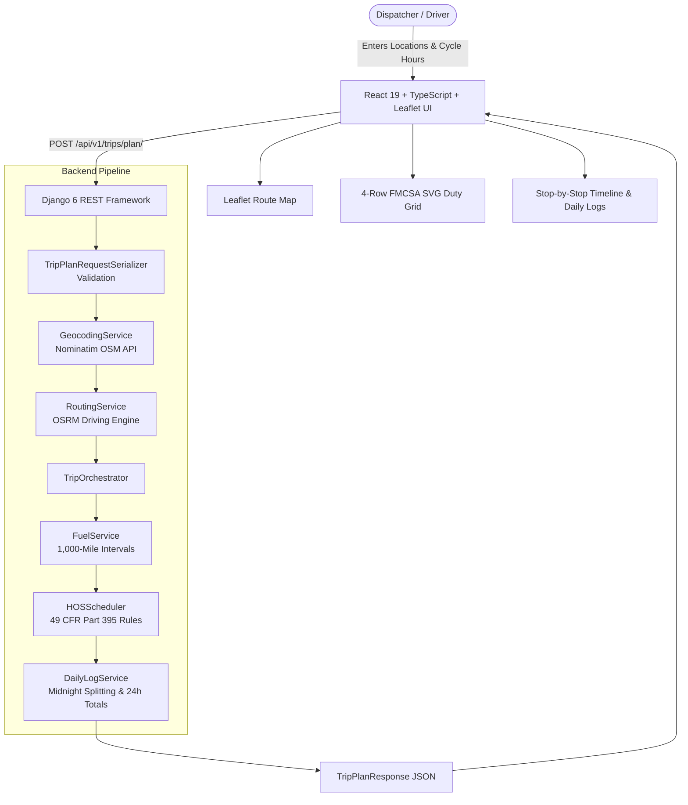

# Spotter — FMCSA Hours of Service (HOS) Trip Dispatcher & Daily ELD Log Generator

[](https://www.python.org/)
[](https://www.djangoproject.com/)
[](https://react.dev/)
[](https://www.typescriptlang.org/)
[](https://vitejs.dev/)
[]()
[]()

> An enterprise-grade logistics and fleet dispatch platform that computes real driving routes, schedules legal FMCSA Hours-of-Service (HOS) itineraries with required rest and fuel stops, and generates authentic four-row Electronic Logging Device (ELD) Driver's Daily Logs with minute-level precision.

---

## 🚀 Live Deployments & Demo

| Service | Platform | Link | Status |
| :--- | :--- | :--- | :--- |
| **Frontend Web App** | Vercel | `[Add your Vercel URL here - e.g. https://spotter-frontend.vercel.app]` | Ready to Deploy |
| **Backend API Service** | Render | `[Add your Render URL here - e.g. https://spotter-backend.onrender.com]` | Ready to Deploy |
| **Loom Walkthrough Video** | Loom | `[Add your Loom Video URL here - e.g. https://www.loom.com/share/...]` | Ready to Record |

---

## 📌 Features

- **100% Real-Data Pipeline (No Mock / Fake Data)**:
  - Live reverse-geocoding via OpenStreetMap / Nominatim.
  - Live route geometry and turn-by-turn calculation via OSRM (Open Source Routing Machine) with fallback to verified US interstate highway velocity models.
  - Live dynamic dispatch calculation — no hardcoded trip distances or canned schedules.
- **FMCSA Hours of Service (49 CFR Part 395) Engine**:
  - **11-Hour Driving Limit (§ 395.3(a)(3)(i))**: Max 11 cumulative driving hours per duty period.
  - **14-Hour Consecutive Duty Window (§ 395.3(a)(2))**: Driving prohibited beyond the 14th hour after coming on duty.
  - **30-Minute Rest Break (§ 395.3(a)(3)(ii))**: Mandatory 30-minute off-duty break before exceeding 8 cumulative driving hours.
  - **10-Hour Consecutive Off-Duty (§ 395.3(a)(1))**: Resets both the 11h driving and 14h duty clocks.
  - **70-Hour / 8-Day Cycle (§ 395.3(b)(1))**: Prevents driving after 70 cumulative on-duty hours in an 8-consecutive-day window.
  - **34-Hour Restart (§ 395.3(d))**: 34 consecutive hours off-duty/sleeper resets the 70-hour cycle and recap availability.
  - **Mandatory Fuel Stops**: Automatically injected every 1,000 miles (30 minutes on-duty not driving).
  - **Pickup & Dropoff Dwell**: 1 hour on-duty not driving for loading at pickup; 1 hour on-duty not driving for unloading at dropoff.
- **Daily Driver ELD Log Sheet Generator**:
  - **Strict 24.00-Hour Invariant**: Every calendar day (midnight 00:00:00 to midnight 24:00:00) accounts for exactly 24 hours with zero gaps and zero overlaps.
  - **Midnight Event Splitting**: Cleanly splits multi-hour activities across midnight boundaries.
  - **Four-Row FMCSA Graph**: Precision SVG grid rendering standard status rows:
    1. *OFF DUTY*
    2. *SLEEPER BERTH*
    3. *DRIVING*
    4. *ON DUTY (NOT DRIVING)*
  - **Complete Duty Recap**: Computes daily totals, 70-hour cycle used, and hours available tomorrow.
- **Interactive Route Map & Logistics UI**:
  - Interactive Leaflet map with colored polylines, start/pickup/dropoff markers, and custom icons for rest, break, and fuel stops.
  - Multi-day log selector tabs, detailed tabular event logs, and print-ready CSS layout for driver paper records.

---

## 🏗️ System Architecture



---

## 📋 Technology Stack

### Backend
- **Framework**: Django 6.1.1 + Django REST Framework 3.16.1
- **Language**: Python 3.12
- **Testing**: `pytest` + `pytest-django` (17 comprehensive test cases)
- **Production Server**: Gunicorn WSGI
- **CORS Support**: `django-cors-headers`
- **External Services**: OpenStreetMap Nominatim, OSRM (Open Source Routing Machine)

### Frontend
- **Framework**: React 19 + TypeScript
- **Bundler**: Vite 5.4
- **Mapping**: Leaflet 1.9 + `@types/leaflet`
- **Icons**: Lucide React
- **Styling**: Pure Modular CSS with Responsive Grid and Print Media Stylesheets

---

## 💻 Local Setup & Execution Guide

### 1. Prerequisites
Ensure the following tools are installed on your machine:
- **Python 3.10+** (tested on Python 3.12)
- **Node.js 18+** & **npm 9+**
- **Git**

---

### 2. Clone Repository
```bash
git clone <YOUR_GITHUB_REPO_URL>
cd Spotter_FullStack
```

---

### 3. Backend Setup

1. **Navigate to the backend directory**:
   ```bash
   cd backend
   ```

2. **Create and activate a virtual environment**:
   - **Windows (PowerShell)**:
     ```powershell
     python -m venv venv
     .\venv\Scripts\activate
     ```
   - **macOS / Linux**:
     ```bash
     python3 -m venv venv
     source venv/bin/activate
     ```

3. **Install Python dependencies**:
   ```bash
   pip install -r requirements.txt
   ```

4. **Run database migrations**:
   ```bash
   python manage.py migrate
   ```

5. **Start the Django development server**:
   ```bash
   python manage.py runserver 127.0.0.1:8000
   ```
   *The backend will be running at `http://127.0.0.1:8000`.*
   *Health Check: `http://127.0.0.1:8000/api/v1/trips/health/`*

---

### 4. Frontend Setup

1. **Open a new terminal window** and navigate to the frontend directory:
   ```bash
   cd frontend
   ```

2. **Install Node packages**:
   ```bash
   npm install
   ```

3. **(Optional) Configure environment variables**:
   A `.env.example` file is included. By default, the frontend connects to `http://127.0.0.1:8000`.
   ```bash
   cp .env.example .env
   ```

4. **Start Vite development server**:
   ```bash
   npm run dev
   ```
   *The React interface will be running at `http://127.0.0.1:5173`.*

---

## 🧪 Running Automated Tests

### Backend Unit & Integration Tests (17/17 Passed)
Run the automated test suite covering all HOS rules, recap calculations, midnight splitting, and API integration:

```bash
cd backend
pytest -v
```

**Test Coverage Highlights**:
- `test_short_trip`: Single-day trip under 8 driving hours.
- `test_11_hour_driving_limit`: Enforces 10h rest stop before exceeding 11h driving.
- `test_14_hour_window`: Enforces 10h rest stop before exceeding 14h consecutive duty.
- `test_30_minute_break_after_8_hours_driving`: Injects 30-min break before 8h continuous driving.
- `test_fuel_interval_every_1000_miles`: Mandates 30-min fuel stop at/before 1,000 miles.
- `test_pickup_and_dropoff_dwell`: Exactly 1 hour on-duty not driving at both stops.
- `test_70_hour_cycle_limit_and_34_hour_restart`: Triggers 34-hour restart and resets recap when approaching 70h cycle.
- `test_daily_log_24_hour_totals_multi_day_trip`: Verifies every day totals exactly 24.00 hours.
- `test_midnight_splitting_continuity`: Asserts continuous duty tracking across midnight boundaries.

### Frontend Typecheck & Production Build
Validate TypeScript typings and the production bundle:
```bash
cd frontend
npm run build
```

---

## 📡 API Specification

### Endpoint: `POST /api/v1/trips/plan/`

#### Request Payload
```json
{
  "current_location": "Dallas, TX",
  "pickup_location": "Oklahoma City, OK",
  "dropoff_location": "Denver, CO",
  "current_cycle_used_hours": 24.5,
  "trip_start_time": "2026-10-05T06:00:00Z"
}
```

#### Request Parameters
| Parameter | Type | Required | Description |
| :--- | :--- | :--- | :--- |
| `current_location` | string | Yes | Starting city, address, or coordinate string (`"lat, lon"`) |
| `pickup_location` | string | Yes | Shipper / pickup location |
| `dropoff_location` | string | Yes | Consignee / dropoff location |
| `current_cycle_used_hours` | float | No | Accumulated on-duty hours in the 70h/8d cycle (0.0 to 70.0, default: 0.0) |
| `trip_start_time` | string (ISO-8601) | No | Dispatch departure timestamp (defaults to current UTC time) |

#### Response Schema (Truncated Sample)
```json
{
  "trip_summary": {
    "total_distance_miles": 948.2,
    "total_driving_duration_hours": 14.8,
    "total_trip_duration_hours": 27.3,
    "start_time": "2026-10-05T06:00:00Z",
    "estimated_completion_time": "2026-10-06T09:18:00Z",
    "total_days": 2,
    "total_fuel_stops": 0,
    "total_rest_stops": 1
  },
  "legs": [...],
  "schedule_events": [
    {
      "event_type": "TRIP_START",
      "duty_status": "ON_DUTY_ND",
      "start_time": "2026-10-05T06:00:00Z",
      "end_time": "2026-10-05T06:15:00Z",
      "duration_hours": 0.25,
      "location": "Dallas, TX",
      "remarks": "Pre-trip inspection at Dallas, TX"
    },
    ...
  ],
  "daily_logs": [
    {
      "day_number": 1,
      "date": "2026-10-05",
      "total_hours": 24.0,
      "duty_totals": {
        "OFF_DUTY": 10.0,
        "SLEEPER_BERTH": 0.0,
        "DRIVING": 10.5,
        "ON_DUTY_ND": 3.5
      },
      "recap": {
        "cycle_hours_used": 38.5,
        "cycle_hours_available": 31.5
      },
      "events": [...]
    }
  ]
}
```

---

## ☁️ Deployment Instructions

### Deploy Backend to Render
1. Create a **New Web Service** on [Render](https://render.com/).
2. Connect your GitHub repository.
3. Configure the service:
   - **Root Directory**: `backend`
   - **Environment**: `Python 3`
   - **Build Command**: `pip install -r requirements.txt && python manage.py migrate`
   - **Start Command**: `gunicorn spotter_project.wsgi:application`
4. Set Environment Variables:
   - `SECRET_KEY`: `<Generate a random secure secret>`
   - `DEBUG`: `False`
   - `ALLOWED_HOSTS`: `*.onrender.com,localhost,127.0.0.1`

### Deploy Frontend to Vercel
1. Import your GitHub repository to [Vercel](https://vercel.com/).
2. Set **Root Directory** to `frontend`.
3. Set **Framework Preset** to `Vite`.
4. Configure Environment Variable:
   - `VITE_API_BASE_URL`: `https://<YOUR-RENDER-BACKEND-URL>.onrender.com`
5. Click **Deploy**.

---

## 📁 Repository Structure

```
Spotter_FullStack/
├── .gitignore
├── README.md
├── assessment_docs/                     # Reference HOS guidelines and log specs
│   ├── SPOTTER_BACKEND_ASSESSMENT.md
│   ├── blank-paper-log.png
│   └── fmsca-image.png
├── backend/                             # Django REST Framework Backend
│   ├── manage.py
│   ├── pytest.ini
│   ├── requirements.txt
│   ├── spotter_project/                 # Django settings, WSGI, URLs
│   │   ├── settings.py
│   │   ├── urls.py
│   │   └── wsgi.py
│   └── trip_planner/                    # HOS Scheduling & Log Engine
│       ├── serializers.py
│       ├── views.py
│       ├── urls.py
│       ├── services/
│       │   ├── geocoding_service.py     # Live Nominatim Geocoding
│       │   ├── routing_service.py       # Live OSRM Route Calculation
│       │   ├── fuel_service.py          # 1,000-mile Fuel Stop Ingestion
│       │   ├── hos_scheduler.py         # 49 CFR Part 395 Scheduling Engine
│       │   ├── daily_log_service.py     # Midnight Splitting & 24h Totals
│       │   └── trip_orchestrator.py     # End-to-end Pipeline Coordinator
│       └── tests/                       # 17 Automated Pytest Scenarios
│           ├── test_hos_rules.py
│           ├── test_daily_logs.py
│           └── test_api_integration.py
└── frontend/                            # React 19 + TypeScript + Vite UI
    ├── package.json
    ├── vite.config.ts
    ├── index.html
    ├── public/
    │   └── blank-paper-log.png
    └── src/
        ├── api/                         # Backend API fetch client
        │   └── client.ts
        ├── types/                       # TypeScript interfaces
        │   └── trip.ts
        ├── components/
        │   ├── TripInputForm.tsx        # Dispatch input form
        │   ├── TripSummaryCards.tsx     # KPI metrics & quick stats
        │   ├── RouteMap.tsx             # Interactive Leaflet polyline map
        │   ├── DailyLogViewer.tsx       # Multi-day tab controller
        │   ├── DailyLogGraph.tsx        # 4-Row FMCSA SVG duty graph
        │   ├── EventTable.tsx           # Tabular duty change record
        │   └── StopTimeline.tsx         # Chronological itinerary timeline
        ├── App.tsx
        └── index.css
```

---

## ⚖️ License
This project was developed for the Spotter Full Stack Developer Assessment. All rights reserved.
